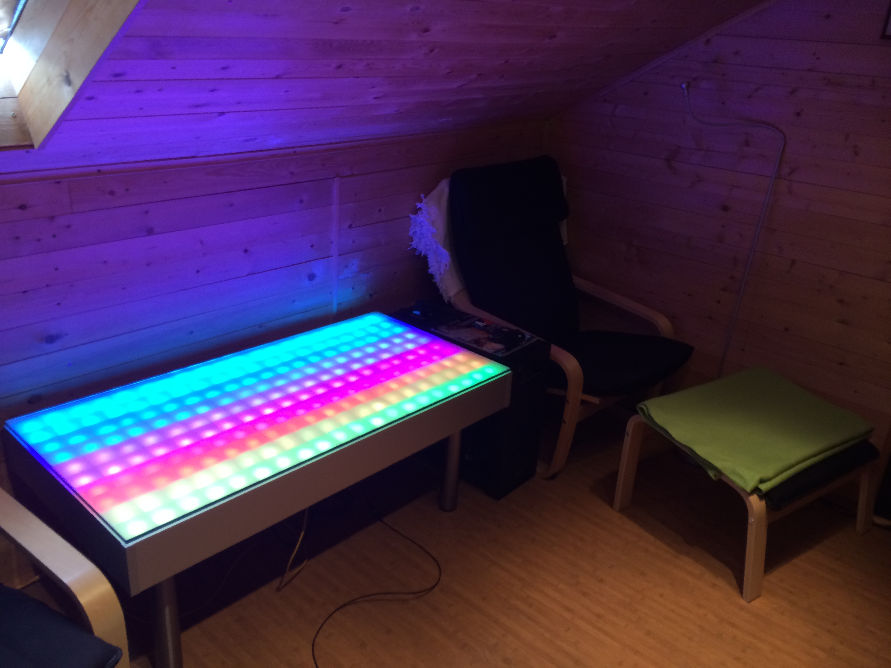
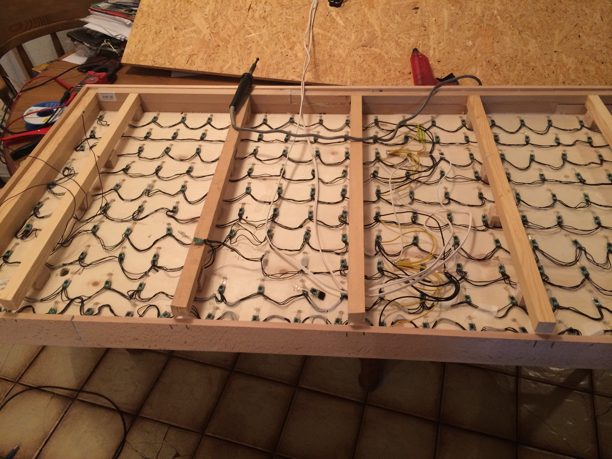
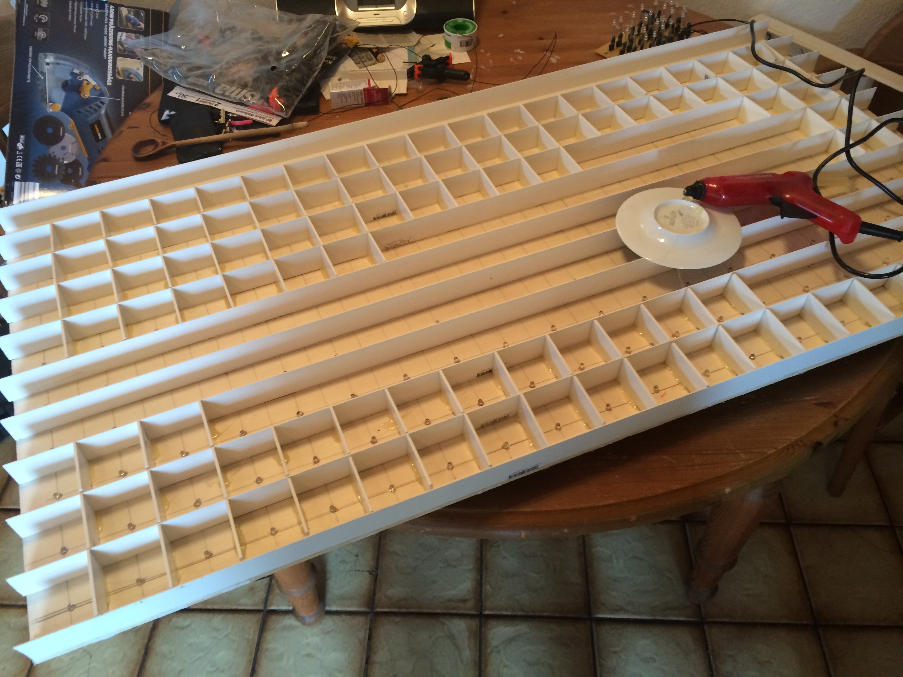
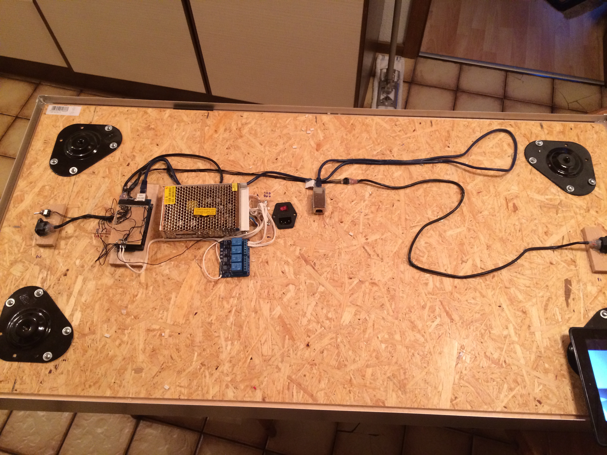

# ArduinoRGBTable
A RGB-Table with 200 pixels, NES Controller support, Webinterface.

# FEATURES
* Tablesize 120x60cm
* 10x20 RGB WS2812 LED MATRIX (6x6xm Pixelsize)
* Webinterface for control
* RTC
* NES Controller Support for Games
* Arduino DUE
* Massive construction so you can jump on
* API
* NIGHTMODE (switch on/off at specific times)

## TABLE MODES
Each mode have several options to customise the color, speed,...

* RAINBOW
* CONSTANT COLOR
* RANDOWM COLOR / RANDOM PIXELS
* CLOCK
* SCROLLING TEXT (with numbers and special characters)
* RSS Display (required a RaspberryPi on SerialPort1 of the Ardino)
* TableInformationSystem (T.I.S) for display text/data from USB

### GAMES
* SNAKE
* 2048
* PAINT
* SENSO
* PONG

# PARTS
* 1 Arduino DUE
* 1 Arduino Ethernet Shield
* 1 RTC Module (DS3231 or DS1307)
* 200 WS2812 5mm RGB LEDs
* 2 NES Controller jack
* 5V 10A switching power supply
* 5V Fan
* 2 Relais
* 1 PCB Pushbutton
* 2 4 channel levelshifter (5V -> 3.3V)
* tons of wires for the leds (but you can buy pre wired leds, DO IT)
* luster terminals
* pcb board
* 1 120x60x10mm plywood ground plate (GROUND_PLATE)
* 1 120x60x3mm poplar wood plate for the leds (LED_PLATE)
* 1 120x60x8mm glass plate
* 1 120x60x3mm acrylic glass plate with 75% 	transparency
* plastic L profiles 
* plastic I profiles
* 10x10mm [] wood profiles
* 30x5mm I wood profiles
* 4 table legs (height depend on your needs)
* alumninium plates for coverage the wood

# TOOLS
* Drill 5mm, 8mm, 10mm
* Hotglue-Gun
* Soldering equipment
* Saw
* woodglue
* (torks) wood screws 20mm, 30mm
* tons of zipties

# HARDWARE SETUP (simplyfied version)
For a long version, send me a message

* drill 200 holes with the 5mm drill into the LED_PLATE with 60mm distance to each other, to get the led matrix
* glue each of the 200 (connected led = one strip, DOUT -> DIN), into one hole of the LED_PLATE, fix it with hotglue
* mount pieces of the 10x10mm [] woodl profiles unter the LED_PLATE for spacing
* drill holes into the GROUND_PLATE for the led wires
* glue and screw the  LED_PLATE with the spacers on to the GROUND_PLATE
* mount the table leg plates on each corner of the GROUND_PLATE
* mount the power supply and the arduino (with rtc connected, relais, switch, nes controllers) under the GROUND_PLATE
* connect relais channel 1 beween  power supply and VCC of the leds
* connect relais channel 2 beween power supply and  VCC of the fan
* connect the first led DIN through the levelshifter to the arduino
*  place the L and I prfiles on top of the LED Plate so that it gives a matrix (see pictures)
* place the I 30x5mm wood prfiles around the GROUND_PLATE/LED_PLATE to build the frame and glue/screw it
* mount/screw the table legs
* place the acrylic glass plate over the matrix
* place the glassplate over the matrix
* cover frame around the table with alumninium plate

# SOFTWARE SETUP (simplyfied version)
For a long version, send me a message

* download the latest Arduino IDE
* download the webserver libary : https://github.com/sirleech/Webduino
* download the flash-storage libary : https://github.com/sebnil/DueFlashStorage
* download the latest sketch from this repo, located at /ARDUINO CODE/table_due_beta35_Websitetitel.txt
* set the pin config (line 9 - 16)
* flash the sketch to your arduino

# USAGE
* connect a ethernet cable
* power it on
* the ip is shown at powering up
* connect to the ip of the table
* look at the settings section for timezone and other settings
* HAVE FUN

## NOTE
At the first power on you must hold the pushbutton, to write the default config

# IMAGES

